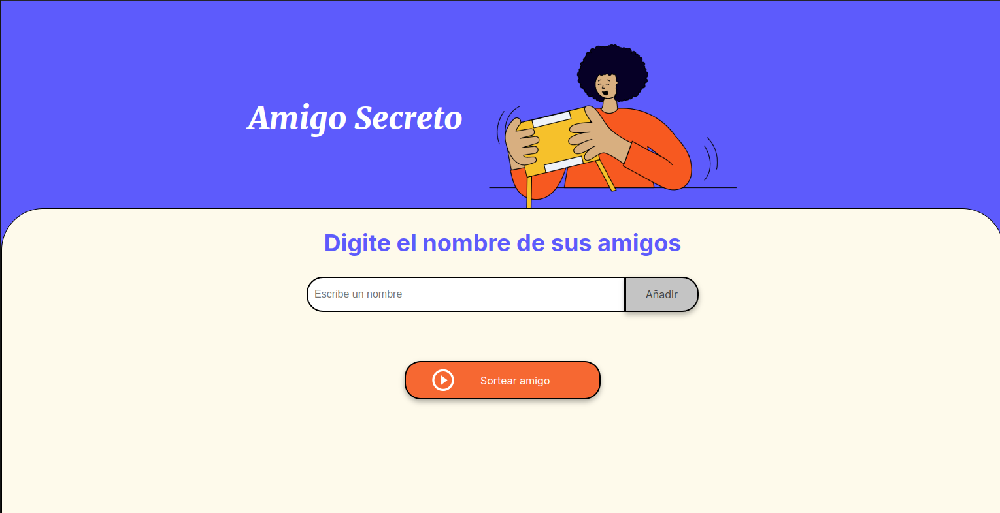

# Amigo Secreto Challenge Alura



[Ver proyecto desplegado](https://amigo-secreto-ten-wheat.vercel.app/)

Este proyecto es una aplicación web para organizar un juego de "Amigo Secreto", donde los usuarios pueden agregar nombres de amigos y sortear un ganador.
PD: Se implementaron 2 soluciones

## Tabla de Contenidos

- [Características](#características)
- [Requisitos](#requisitos)
- [Instalación](#instalación)
- [Dependencias](#dependencias)
- [Uso](#uso)
- [Contacto](#contacto)

## Características

- Agregar nombres de amigos.
- Sortear un amigo secreto al azar.
- Interfaz amigable y responsiva.

## Requisitos

- Navegador web moderno.
- Editor de texto
- Live server u otra extensión que permita levantar el proyecto en local

## Instalación

Instrucciones para instalar el proyecto.

```bash
# Clonar el repositorio
git clone https://github.com/WanderleeDev/Alura-projects-G8

# Navegar al directorio del proyecto
cd  challenge-amigo-secreto_esp-main
```

## Dependencias

- No se requieren dependencias adicionales para este proyecto.

## Uso

Instrucciones sobre cómo usar el proyecto.

```bash
# Levantar un servidor local, recomendación live server en Visual Code

# Opcional: Puedes  abrir el archivo index.html en un navegador directamente

```

## Contacto

[Wanderlee Max](https://www.linkedin.com/in/wanderlee-max/)

- GitHub: [@WanderleeDev](https://github.com/WanderleeDev)
- LinkedIn: [@WanderleeMax](https://www.linkedin.com/in/wanderlee-max/)
